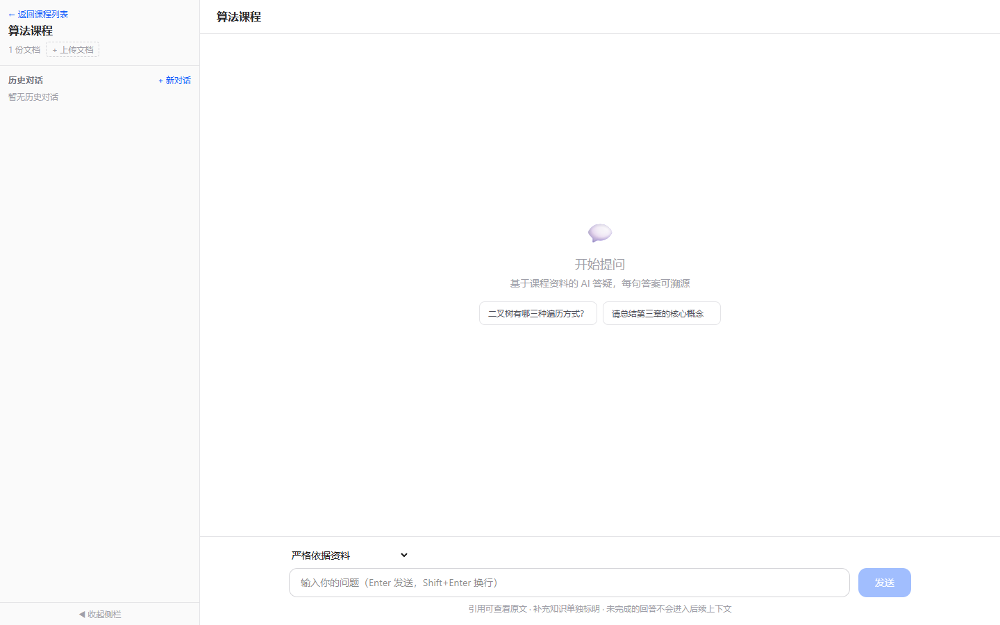

# 📚 Kecap — RAG-Powered AI Study Assistant

**[English](#english) | [中文](#中文)**

---

<a id="english"></a>

## Introduction

Students upload course materials (textbooks, slides, notes), and the assistant provides **accurate, traceable** AI Q&A and adaptive practice based on RAG (Retrieval-Augmented Generation).



## Tech Stack

| Layer | Technology |
|-------|-----------|
| Frontend | Next.js 16 + React 19 + Tailwind CSS 4 |
| Backend | Python FastAPI |
| LLM | DeepSeek V3 API |
| Embedding | SiliconFlow BGE-M3 |
| Vector Database | Qdrant |
| Database | SQLite (local) / PostgreSQL (Docker) |
| Voice TTS | GPT-SoVITS (optional) |

## 🚀 Quick Start (Standalone EXE)

### 1. Download

👉 **[Download the latest Windows release](https://github.com/Asrielehat/kecap/releases/latest)**

Or visit the [Releases page](https://github.com/Asrielehat/kecap/releases) for the latest version.

### 2. Requirements

An internet connection (cloud AI APIs are called at runtime).

### 3. Get API Keys

| Service | Website |
|---------|---------|
| DeepSeek (LLM) | https://platform.deepseek.com |
| SiliconFlow (Embedding) | https://siliconflow.cn |

Sign up on each platform, create an API key, and keep them handy.

### 4. Configure & Run

Unzip the archive. The folder contains:

```
课答Kecap/
├── 课答.exe            ← Double-click to launch
├── .env.example        ← Config template (copy and rename to .env)
├── 使用说明.txt         ← Usage instructions
├── data/               ← Auto-generated (database, vector index)
└── uploads/            ← Auto-generated (uploaded files)
```

**Steps:**

1. Unzip to any location
2. Copy `.env.example` and rename the copy to `.env`
3. Open `.env` in Notepad and fill in your API keys:
   ```
   LLM_API_KEY=sk-your-deepseek-key
   EMBEDDING_API_KEY=sk-your-siliconflow-key
   ```
4. Double-click `课答.exe`
5. Your browser opens http://localhost:8000 automatically — start using it

### 5. Quit

Just close the console window.

---

## Developer Setup (Full Environment)

> For development, debugging, and Docker deployment.

### 1. Prerequisites

- Python ≥ 3.10
- Node.js ≥ 18
- Docker Desktop

### 2. Register API Keys

| Service | Website |
|---------|---------|
| DeepSeek (LLM) | https://platform.deepseek.com |
| SiliconFlow (Embedding) | https://siliconflow.cn |

### 3. Configure Environment Variables

Edit `backend/.env` and fill in your API keys:

```env
LLM_API_KEY=sk-your-deepseek-key
EMBEDDING_API_KEY=sk-your-siliconflow-key
```

### 4. Start Infrastructure

```bash
docker compose up -d
```

### 5. Start Backend (API only)

```bash
cd backend
pip install -r requirements.txt
uvicorn app.main:app --reload --port 8000
```

Visit http://localhost:8000/docs for the API documentation.

### 6. Start Full-Stack (API + Frontend)

```bash
cd backend
pip install -r requirements.txt
python app/main_exe.py
```

This serves both the API and the frontend at http://localhost:8000. Make sure to build the frontend first:

```bash
cd frontend
npm install
NEXT_EXPORT=1 npm run build
```

### 7. Start Frontend (Dev Mode)

```bash
cd frontend
npm install
npm run dev
```

Visit http://localhost:3000

## Project Structure

```
kecap/
├── docker-compose.yml        # Qdrant + PostgreSQL
├── backend/
│   ├── app/
│   │   ├── main.py           # FastAPI entry point
│   │   ├── main_exe.py       # EXE entry point (serves API + frontend static files)
│   │   ├── core/
│   │   │   ├── config.py     # Configuration management
│   │   │   └── database.py   # Database connection
│   │   ├── models/
│   │   │   ├── db_models.py  # SQLAlchemy models
│   │   │   └── schemas.py    # Pydantic request/response
│   │   ├── api/
│   │   │   ├── upload.py     # Document upload API
│   │   │   ├── chat.py       # RAG Q&A + Follow-up API
│   │   │   ├── courses.py    # Course management API
│   │   │   ├── conversations.py  # Conversation history API
│   │   │   └── feedback.py   # Message feedback API
│   │   ├── skills/
│   │   │   └── loader.py     # Skill system (SKILL.md loading)
│   │   └── rag/
│   │       ├── document_processor.py  # Document parsing + chunking
│   │       ├── vector_store.py        # Qdrant vector store
│   │       ├── retriever.py           # Hybrid retrieval + reranking
│   │       ├── planner.py             # Sub-question planning (agent)
│   │       └── generator.py           # LLM answer generation
│   ├── requirements.txt
│   ├── Dockerfile
│   └── .env
└── frontend/
    └── src/app/
        └── page.tsx          # Main chat interface
```

## Features

### 💬 RAG Q&A
Ask questions about your course materials. The default pipeline uses semantic retrieval and generates answers with inline citations. Optional BM25 fusion and Cross-encoder reranking can be enabled after evaluation.

Choose **Strict sources** when an answer must stay within uploaded materials, or **Sources + supplemental knowledge** when general background is useful. Supplemental knowledge is marked separately.

### 🔍 Follow-up (Context-Isolated)
Select any text in an answer to ask a follow-up question in a draggable modal. Follow-ups are **context-isolated** — they don't pollute the main conversation history. Supports **nested follow-up chains** (ask follow-ups within follow-ups).

### 🧠 Agentic RAG Pipeline
The assistant **plans before answering**: it decomposes the question into up to 3 sub-questions, retrieves for each one, merges & deduplicates the hits, then **self-checks** the final answer against the source material and revises it if it drifts or misses key points. (Tunable via `AGENT_PLANNING_ENABLED` / `ANSWER_SELFCHECK_ENABLED`.)

### 🎯 Vague Follow-up Anchoring
When you ask a follow-up like "explain it with a different example" without restating the topic, the system automatically **anchors it to the previous topic** instead of searching blindly.

### 🗑️ Message Deletion
Delete any user or AI message — along with its follow-up chain — to fix input mistakes or remove polluted context. An always-visible delete button sits on each message.

### 📦 Skill System
Drop a `SKILL.md` into `backend/skills/<skill-name>/` to inject custom behavior (name / description / triggers / force mode / full-history) into the LLM.

### 📚 Document Management
Upload PDF, PPTX, DOCX, MD, and TXT files. Uploads use generated storage names, enforce the configured size limit, expose processing progress, and recover interrupted indexing jobs. Scanned PDFs need OCR before upload.

### 📝 Conversation History
All Q&A sessions are saved. Switch between conversations in the sidebar.

## API Overview

| Method | Path | Description |
|--------|------|-------------|
| POST | `/api/courses/` | Create a course |
| GET | `/api/courses/` | List courses |
| GET | `/api/courses/{course_id}` | Get course details |
| DELETE | `/api/courses/{course_id}` | Delete a course |
| POST | `/api/documents/upload` | Upload a document (auto parse + vectorize) |
| POST | `/api/chat/ask` | RAG Q&A (returns answer + citations) |
| POST | `/api/chat/ask/stream` | Streaming RAG Q&A (SSE) |
| POST | `/api/chat/follow-up` | Context-isolated follow-up Q&A (supports nesting) |
| GET | `/api/conversations/{course_id}` | List conversations of a course |
| GET | `/api/conversations/{conversation_id}/messages` | Get conversation messages |
| DELETE | `/api/conversations/{conversation_id}/messages/{message_id}` | Delete a message (and its follow-up chain) |
| DELETE | `/api/conversations/{conversation_id}` | Delete a conversation |
| POST | `/api/feedback/{message_id}` | Submit message feedback |
| GET | `/api/feedback/stats/{course_id}` | Get feedback statistics |

## RAG Pipeline

```
User question → (Agent) Sub-question planning → semantic retrieval
→ optional BM25 fusion → optional Cross-encoder reranking → LLM generation
→ self-check & revise → citations with source preview
→ Sentence-level citation annotation → Response

Follow-up: Selected text + context paragraph → Anchor retrieval → LLM explanation
→ Saved to follow_ups table (isolated from main conversation)

Delete message: removes the message and its follow-up chain from the conversation
```

---
---

<a id="中文"></a>

# 📚 课答 —— RAG 增强的 AI 学业辅导智能体

## 项目简介

学生上传课程资料（教材、课件、笔记），智能体基于 RAG 技术提供**精准、可溯源**的 AI 答疑与自适应练习。

## 技术栈

| 层级 | 技术 |
|------|------|
| 前端 | Next.js 16 + React 19 + Tailwind CSS 4 |
| 后端 | Python FastAPI |
| LLM | DeepSeek V3 API |
| Embedding | 硅基流动 BGE-M3 |
| 向量数据库 | Qdrant |
| 业务数据库 | SQLite（本地）/ PostgreSQL（Docker） |
| 语音 TTS | GPT-SoVITS（可选） |

## 🚀 快速使用（EXE 一键版）


### 1. 下载

👉 **[下载最新 Windows 版本](https://github.com/Asrielehat/kecap/releases/latest)**

或前往 [Releases 页面](https://github.com/Asrielehat/kecap/releases) 选择最新版本。

### 2. 准备

确保你的电脑能正常访问互联网（需要调用云端 AI API）。

### 3. 获取 API Key

| 服务 | 地址 |
|------|------|
| DeepSeek（LLM） | https://platform.deepseek.com |
| SiliconFlow（Embedding） | https://siliconflow.cn |

注册后在对应平台创建 API Key，复制备用。

### 4. 配置并启动

解压下载的 zip，文件夹内容如下：

```
课答Kecap/
├── 课答.exe            ← 双击启动
├── .env.example        ← 配置模板（复制一份改名为 .env）
├── 使用说明.txt
├── data/               ← 自动生成（数据库、向量索引）
└── uploads/            ← 自动生成（上传的文件）
```

**操作步骤：**

1. 解压 zip 到任意位置
2. 把 `.env.example` 复制一份，重命名为 `.env`
3. 用记事本编辑 `.env`，填入自己的 API Key：
   ```
   LLM_API_KEY=sk-你的deepseek-key
   EMBEDDING_API_KEY=sk-你的siliconflow-key
   ```
4. 双击 `课答.exe`
5. 浏览器会自动打开 http://localhost:8000，即可使用

### 5. 关闭

直接关闭控制台黑窗口即可。

---

## 开发者部署（完整环境）

> 适合开发、调试、Docker 部署。

### 1. 前置条件

- Python ≥ 3.10
- Node.js ≥ 18
- Docker Desktop

### 2. 注册 API Key

| 服务 | 地址 |
|------|------|
| DeepSeek（LLM） | https://platform.deepseek.com |
| SiliconFlow（Embedding） | https://siliconflow.cn |

### 3. 配置环境变量

编辑 `backend/.env`，填入你的 API Key：

```env
LLM_API_KEY=sk-your-deepseek-key
EMBEDDING_API_KEY=sk-your-siliconflow-key
```

### 4. 启动基础设施

```bash
docker compose up -d
```

### 5. 启动后端（仅 API）

```bash
cd backend
pip install -r requirements.txt
uvicorn app.main:app --reload --port 8000
```

访问 http://localhost:8000/docs 查看 API 文档。

### 6. 启动一体化服务（API + 前端）

```bash
cd backend
pip install -r requirements.txt
python app/main_exe.py
```

同时提供 API 和前端页面，访问 http://localhost:8000。需先构建前端：

```bash
cd frontend
npm install
NEXT_EXPORT=1 npm run build
```

### 7. 启动前端（开发模式）

```bash
cd frontend
npm install
npm run dev
```

访问 http://localhost:3000

## 项目结构

```
kecap/
├── docker-compose.yml        # Qdrant + PostgreSQL
├── backend/
│   ├── app/
│   │   ├── main.py           # FastAPI 入口
│   │   ├── main_exe.py       # EXE 入口（API + 前端静态文件一体化）
│   │   ├── core/
│   │   │   ├── config.py     # 配置管理
│   │   │   └── database.py   # 数据库连接
│   │   ├── models/
│   │   │   ├── db_models.py  # SQLAlchemy 模型
│   │   │   └── schemas.py    # Pydantic 请求/响应
│   │   ├── api/
│   │   │   ├── upload.py     # 文档上传 API
│   │   │   ├── chat.py       # RAG 答疑 + 追问 API
│   │   │   ├── courses.py    # 课程管理 API
│   │   │   ├── conversations.py  # 对话历史 API
│   │   │   └── feedback.py   # 消息反馈 API
│   │   ├── skills/
│   │   │   └── loader.py     # 技能系统（SKILL.md 加载）
│   │   └── rag/
│   │       ├── document_processor.py  # 文档解析 + 分块
│   │       ├── vector_store.py        # Qdrant 向量存储
│   │       ├── retriever.py           # 混合检索 + 重排序
│   │       ├── planner.py             # 子问题规划（智能体）
│   │       └── generator.py           # LLM 答案生成
│   ├── requirements.txt
│   ├── Dockerfile
│   └── .env
└── frontend/
    └── src/app/
        └── page.tsx          # 主聊天界面
```

## 功能介绍

### 💬 RAG 答疑
基于课程资料提问。默认使用语义检索并生成带溯源引用的答案；经过评测后可启用 BM25 融合与 Cross-encoder 重排。

回答依据可选择“严格依据资料”或“资料优先，允许补充知识”。补充知识会单独标明。

### 🔍 追问（上下文隔离）
在回答中选中任意文字即可弹出拖拽式追问窗口。追问**上下文隔离**，不会污染主对话历史。支持**嵌套追问链**（追问弹窗内继续追问）。

### 🧠 智能体流水线（Agentic RAG）
回答前先**规划**：把问题拆解成最多 3 个子问题，逐个检索后合并去重，再对最终答案对照资料**自检**，跑偏、漏关键点或有错就自动重写。（`AGENT_PLANNING_ENABLED` / `ANSWER_SELFCHECK_ENABLED` 可开关。）

### 🎯 模糊追问锚定
追问"换个例子解释一下""再详细点"这类没带主题的话时，系统自动**锚定到上一话题**检索，而不是盲搜。

### 🗑️ 消息删除
可删除任意一条用户或 AI 消息——连同它的追问链一起——修正输入错误、清理被污染的上下文。每条消息上都有常驻可见的删除按钮。

### 📦 技能（Skill）系统
在 `backend/skills/<技能名>/` 放入 `SKILL.md` 即可向模型注入自定义行为（name / description / triggers / force / 全历史等），实现按需定制。

### 📚 文档管理
支持上传 PDF、PPTX、DOCX、MD、TXT 文件，自动解析、分块、向量化。上传过程使用随机存储名、限制文件大小、显示处理进度，并可在启动时恢复中断任务。扫描版 PDF 需先完成 OCR。

### 📝 对话历史
所有问答自动保存，可在侧栏切换历史对话。

## API 概览

| 方法 | 路径 | 说明 |
|------|------|------|
| POST | `/api/courses/` | 创建课程 |
| GET | `/api/courses/` | 课程列表 |
| GET | `/api/courses/{course_id}` | 课程详情 |
| DELETE | `/api/courses/{course_id}` | 删除课程 |
| POST | `/api/documents/upload` | 上传文档（自动解析+向量化） |
| POST | `/api/chat/ask` | RAG 答疑（返回答案+引文） |
| POST | `/api/chat/ask/stream` | 流式 RAG 答疑（SSE） |
| POST | `/api/chat/follow-up` | 上下文隔离追问（支持嵌套） |
| GET | `/api/conversations/{course_id}` | 课程下的对话列表 |
| GET | `/api/conversations/{conversation_id}/messages` | 获取对话消息 |
| DELETE | `/api/conversations/{conversation_id}/messages/{message_id}` | 删除消息（含追问链） |
| DELETE | `/api/conversations/{conversation_id}` | 删除对话 |
| POST | `/api/feedback/{message_id}` | 提交消息反馈 |
| GET | `/api/feedback/stats/{course_id}` | 反馈统计 |

## RAG 链路

```
用户提问 → (智能体)子问题规划 → 语义检索
→ 可选 BM25 融合 → 可选 Cross-encoder 重排 → LLM 生成
→ 自检并修正 → 引用与原文预览
→ 逐句标注引用来源 → 返回给用户

追问: 选中文字 + 上下文段落 → 锚点检索 → LLM解释
→ 存入 follow_ups 表（与主对话隔离）

删除消息: 连同其追问链一起从对话中移除
```

## 开发验证

```bash
# 后端隔离测试（不会读取本地 .env、课程数据库或上传资料）
python backend/scripts/run_tests.py

# 离线检索基线；结果写入指定 JSON
python backend/scripts/evaluate_rag.py --output evaluation-report.json

# 前端检查
cd frontend
npm run lint
npm run typecheck
npm test
npm run build
```

`backend/evaluation/study_qa.json` 是人工编写的工程回归集。离线分数只用于发现检索回归，不能代替真实课程上的答案和引用人工评审。可选混合检索与重排分别由 `HYBRID_RETRIEVAL_ENABLED`、`RERANKER_ENABLED` 控制；重排还需安装 `sentence-transformers`。

## 许可

本项目采用 [MIT License](LICENSE) 开源许可。
